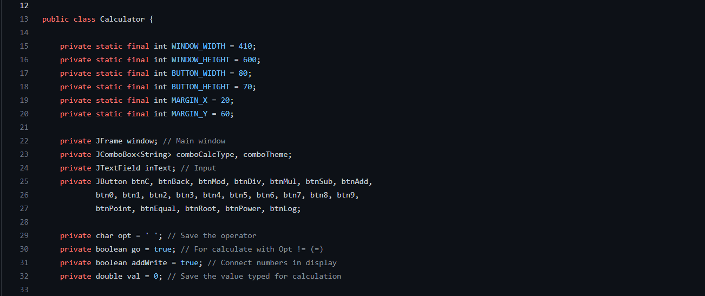
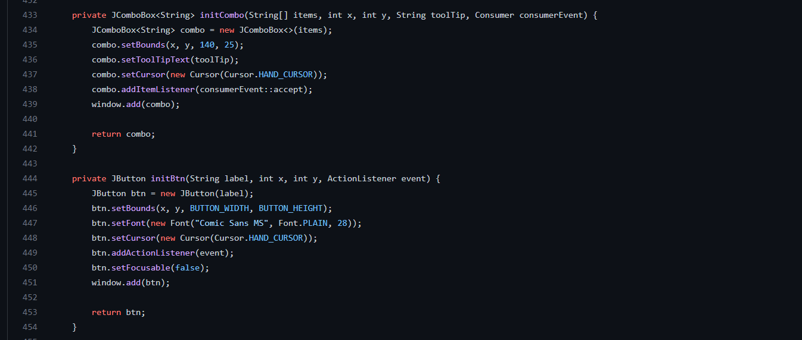
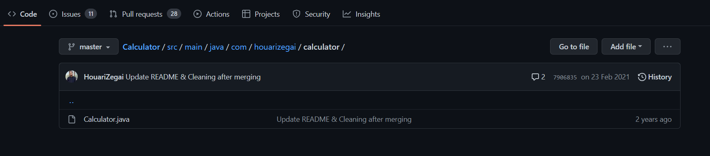
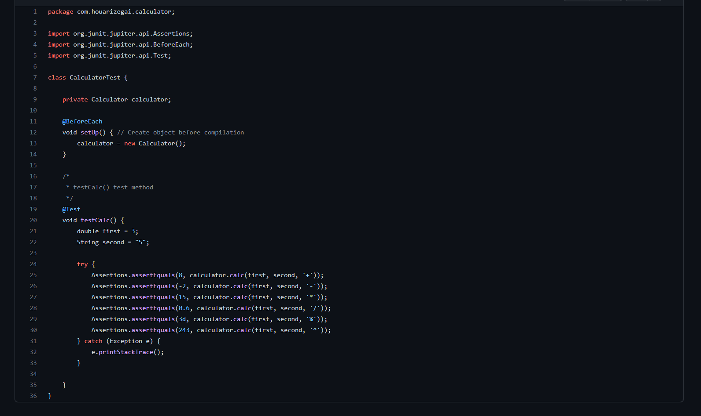
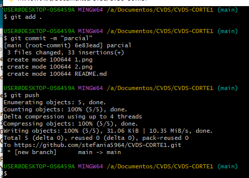

# *PARCIAL Daniel Builes- Stefania Giraldo*

## Paso a paso  
1. **se realizo el repositorio en nuestro github**

2. **clonar repositorio a refactorizar**

3.**Identificar malas practicas**
> hacer una clase maestra donde contiene todos los metodos

> hace en una sola clase la parte de presentacion y la parte de dominio

> no tiene documentacion

4. **soluciones para malas practicas**
> separar los metodos en diferentes clases y diferenciar funcionalidades de los metodos
> hacer paquete de capa de presentacion y de dominio
> realizar la documentacion correspondiente pero no extensa
> realizar cambio de nombres a los metodos para evitar tanta documentacion

5.**UT**
> una mala practica en las pruebas de unidad  es que falta especificar el patron AAA (Arrange,Act,Assert)

> En los test no se prueba en su totalidad lo que deberia realizar el programa(Mock)

> Las pruebas no se pueden realizar todas en un solo test,esto es una muy mala practica

6. **Soluciones UT**
> se realiza el patron AAA a todas las pruebas
> se realizan test que utilicen operaciones mas complejas
> se realizan pruebas en metodos por separado

7. **Patterns**
> se encontro que el patron que aplica en este proyecto es el patron estructurales
 ya que estos se encargan de realizar la estructara de las cosas

8. **add,commit, push**

